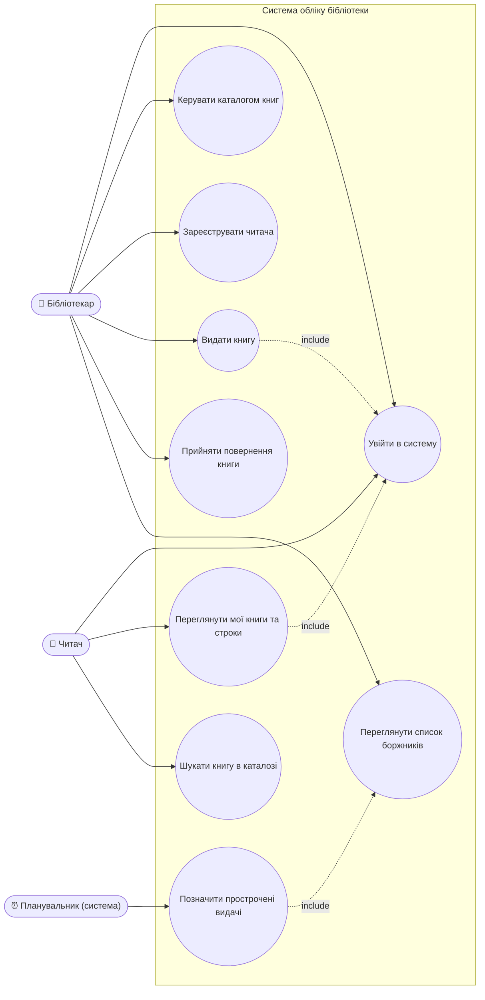

# Use Case Diagram — Система обліку видачі та повернення книг

Актори: **Бібліотекар**, **Читач**, **Планувальник (система)**.

## Опис сценаріїв

| Use case | Актор | Короткий опис | Вимога |
|---|---|---|---|
| Увійти в систему | Бібліотекар, Читач | Автентифікація за e-mail і паролем; визначення ролі | NFR-02 |
| Керувати каталогом книг | Бібліотекар | Додати / редагувати / видалити книгу | FR-01 |
| Зареєструвати читача | Бібліотекар | Створити профіль, згенерувати номер квитка | FR-02 |
| Видати книгу | Бібліотекар | Зафіксувати видачу з датами, перевірити обмеження | FR-03 |
| Прийняти повернення книги | Бібліотекар | Зафіксувати повернення, обчислити прострочення | FR-04 |
| Переглянути список боржників | Бібліотекар | Список прострочених видач із сортуванням | FR-05 |
| Переглянути мої книги та строки | Читач | Книги на руках, строки, історія | FR-03, FR-04 |
| Шукати книгу в каталозі | Читач | Пошук за назвою/автором, доступність | US-06 (SRS v2) |
| Позначити прострочені видачі | Планувальник | Щоденна перевірка строків о 00:00 | FR-05 |
